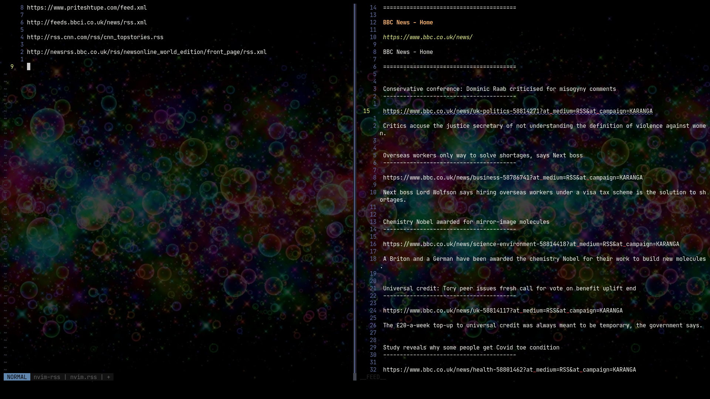

# nvim-rss

A simple rss reader for neovim written in lua.

## Project Goals

I aim for it to be similar to the excellent [vnews](https://github.com/danchoi/vnews) and, if you squint hard enough while looking sideways, then perhaps [elfeed](https://github.com/skeeto/elfeed).

Ideally, if you have a bunch of feeds and wish to simply view them in neovim instead of browsers or dedicated apps, then this plugin should help you out.

## Show-case of experimental version



## Pre-requisites (installation cmd for yay)

1. [neovim](https://neovim.io/) | `yay -S neovim`
2. [curl](https://curl.se/) | `yay -S curl` | Usually pre-installed on most systems
3. [sqlite3](https://sqlite.org/index.html) | `yay -S sqlite3` | Usually pre-installed on some systems
4. [feed-parser](https://github.com/slact/lua-feedparser) | `luarocks install feedparser`
5. [sqlite.lua](https://github.com/tami5/sqlite.lua) | `luarocks install sqlite`

## Installation

__Tested on linux, may work on macos. Probably won't work on windows.__

If `vim-plug` then

```vim
Plug 'empat94/nvim-rss'
```

Else your usual way of installing plugins

## Setup

Inside init.lua

```lua
-- default values
require("nvim-rss").setup({
  feeds_dir = "~", -- ensure has write permissions
  verbose = false -- shows more output in messages and entries
})
```

If using init.vim, wrap the code inside `lua << EOF ... EOF`

## Usage

__By default, no mappings/commands present. All functions are exposed so you may use them as you like!__

* Open RSS File: `open_feeds_tab()`

Opens nvim.rss file where all the feeds are listed. By default `~/nvim.rss`, see [Setup](#Setup) to change default dir.

* Refresh a Feed: `fetch_feed()`

Pulls data from server for the feed under cursor, updates database and opens a vertical split to show the entries.

---

To use above functions, write the usual mapping or command syntax. Example -

```vim
command! OpenRssView lua require("nvim-rss").open_feeds_tab()
command! FetchFeed lua require("nvim-rss").fetch_feed()
```

```vim
:OpenRssView
:FetchFeed
```

## Roadmap

v0.1

- [x] Fetch & parse feeds
- [x] Setup a database
- [x] Update UI for new feed data
- [x] Clean up Rssview for better reading
- [x] Check multiple streams for different data structures
- [ ] Release v0.1 (Deadline : 13th Oct 2021)

v0.2

- [ ] OPML import/export
- [ ] Unread feed highlight
- [ ] Total and unread entries count
- [ ] Refresh all feeds
- [ ] Make db calls async
- [ ] Solve db locked error

v0.3 and above (Tentative)

- [ ] Mark favorite feeds, star entries
- [ ] Use <Plug> to expose functions
- [ ] Console browser intergation
- [ ] Most viewed, most recent, favorite feeds view
- [ ] Highlight entries (new, read, starred)
- [ ] Add testing framework
- [ ] Windows support

## Personal Goals

1. Learn lua (I plan to make a few more plugins!)
2. Learn how to make a neovim plugin
3. Contribute to the awesome neovim ecosystem
4. Share some opensource love <3
